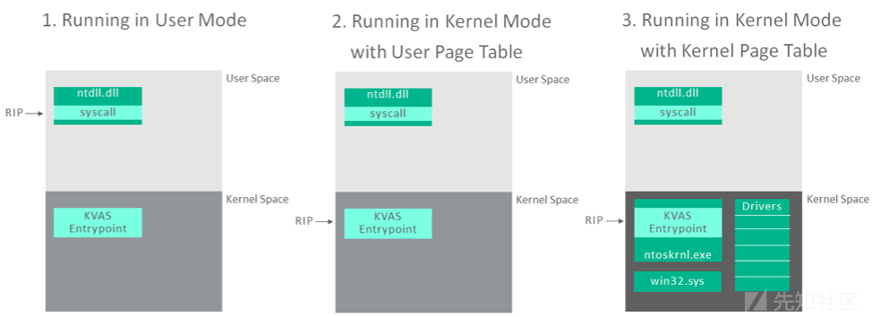
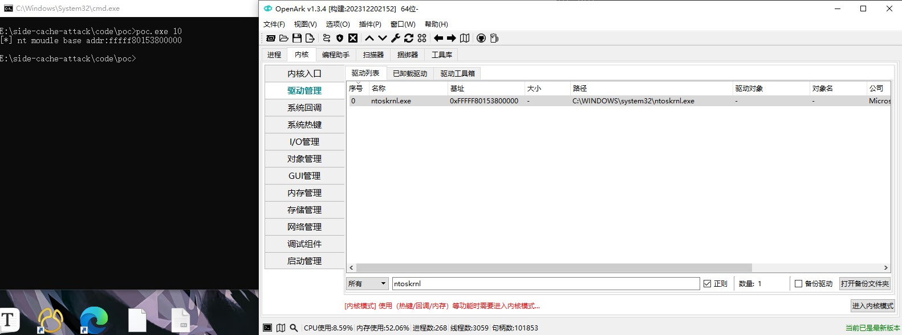

# Exploiting side channels to bypass KVA and KASLR

## Windows:

Kaslr and  Kva bypass

Platform:

Windows 10 (build 3086) and Windows 11 (build 2861). Note that I have only tested on these two systems. However, theoretically, all Windows systems in the Intel series that support the KVA mechanism could be targeted for attack.

## Bounty Program:

Mitigation Bypass and Bounty for Defense

## Summary:

Kaslr as a mitigation added to Windows to prevent getting Windows kernel base address for user process. Kva as a mitigation added to Windows to prevent Spectre side channels.

## Description:

To prevent easily obtaining the Windows kernel base address for user processes, Windows employs a mechanism called KASLR that randomizes the base address of the Windows kernel each time the system starts.

To prevent the acquisition of important Windows information through Spectre side channel attacks, Windows introduces a mechanism called KVA. Before supporting KVA, a user process had only one page table that simultaneously mapped the kernel address space and the user address space. This made it easy for Spectre side channel attacks to obtain important Windows information.After deploying the KVA mechanism, the process's virtual address space is divided into two separate page tables: one for code running in kernel mode and another for code running in user mode. The kernel-mode pages map the entire address space (both user and kernel spaces), while the user-mode page table only maps the minimum kernel space required for ring 3 and ring 0 transitions. The code responsible for executing the translation process is located in ntoskrnl.exe, within a specific section named KVASCODE.



It is precisely because the user-mode page table includes mappings for the kernel space that bypassing KVA becomes possible in obtaining the kernel base address. We can use prefetch to achieve this goal.

prefetch instruction has two characteristics: first, prefetching an invalid address does not result in an error; second, it ignores privilege checks, meaning that even for kernel addresses, prefetching can succeed as long as it is within the current user-mode page table.

In the x64 Windows system, there are a total of four-level page tables. Under normal circumstances, disregarding the presence of TLB (Translation Lookaside Buffer), the translation of an existing virtual address to a physical address requires accessing four page tables. It starts with accessing PDPT (Page Directory Pointer Table), followed by PD (Page Directory), PT (Page Table), and finally the Pages. If there is no PD address in the corresponding PDPT entry in the PDPT, the translation terminates; otherwise, it continues to the next level of translation. Therefore, the time taken for the translation process to stop at PDPT and to stop at PD is different, with the latter usually taking more time than the former.

Hence, we can utilize the prefetch instruction to test all PDPT entries and obtain the time required for their prefetching. Entries with longer times may contain potentially valid PDPT addresses. We measure all PDPT entries for the address 0xffff800000000000 to obtain as many potentially valid PDPT addresses as possible. On the valid PDPT addresses, we then measure the time required to prefetch all PD entries to determine the PD address. The same process applies to determining PT addresses. Ultimately, we identify the first 21 bits of the kernel address, although there may be multiple possible addresses.


The determination of effective entries in the fourth-level page table differs from the methods used earlier. When executing the syscall instruction in user mode, it jumps to the KISystemCall64Shadow() function in the ntoskrnl kernel module mentioned earlier. This function is undoubtedly mapped into the user-mode page table. Therefore, by continually executing syscalls, this function's virtual address will be refreshed into the TLB. Thus, prefetching the page where this function resides takes much less time compared to prefetching invalid pages or pages not in the TLB. Exploiting this time difference allows us to obtain as many effective pages as possible.

Due to the ntoskrnl kernel module being mapped into the user-mode page table as large pages, specifically 2MB pages, the logical address bits 12 to 20 (starting from 0) of the KISystemCall64Shadow() function match those of the virtual address. Therefore, we can utilize the logical address of the KISystemCall64Shadow() function in the ntoskrnl.exe to filter virtual addresses, ultimately obtaining the virtual page address where the KISystemCall64Shadow() function resides. Finally, subtracting a fixed offset (which varies across different versions of ntoskrnl.exe) yields the base address of the ntoskrnl kernel module.

Therefore, by leveraging the prefetch mechanism, we obtained the kernel base address (kernel information) and successfully bypassed both KVA and KASLR.

## Proof of Concept:

I have provided POC (Proof of Concept) code and programs for Windows 10 (build 3086) and Windows 11 (build 2861). The corresponding versions of ntoskrnl.exe for these two systems are 10.0.19041.3086 and 10.0.22621.2861, respectively. If using a different version of the Windows system, you only need to modify the offset values at the corresponding locations in the code to make it fully compatible with that system. Follow these steps:

1) Extract the PoC to a location on a local hard disk which is executableby a normal user.
2) Execute the poc executable file as low integrity passing one argument,the version of Windows system. For example,if you use windows10 :

```sh
poc.exe 10
```

Note that the more cores the machine has, the faster POC.exe obtains results. I ran this program on a machine with 8 cores, and the speed is acceptable.

## Expected Result:

In normal circumstances, low-privilege processes are unable to obtain access to the `ntoskrnl` kernel module.

## Observed Result:

The poc.exe has outputted the base address of the `ntoskrnl` kernel module.The left shows the execution result of poc.exe, while the right demonstrates verification using the ark tool.



